A python generator for creating modular box in openSCAD

Created mostly for organizers for board games, but can be used elsewhere just as successfully.

overview of the classes hierarchy:

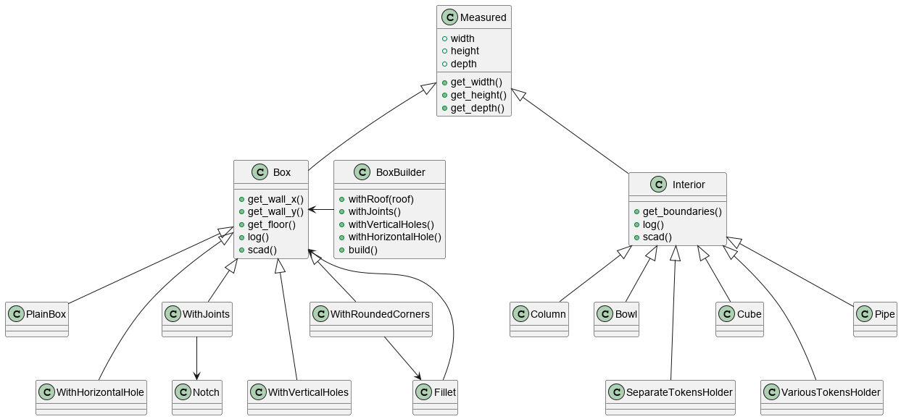

Implemented interiors for boxes are:

Bowl (parameters for the example on the picture):
    width = 50,
    height = 75,
    depth = 20
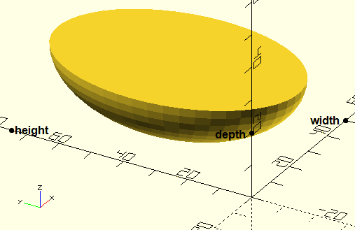
    
Column:
    diameter = 7.5,
    depth = 13,
    segments = 6
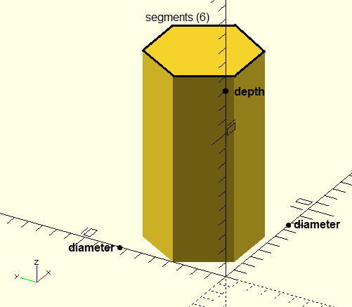

Cube:
    width = 26,
    height = 105,
    depth = 31
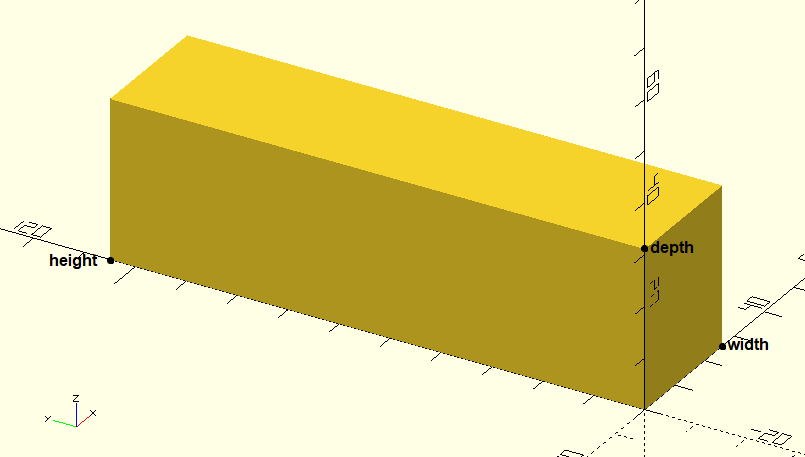

Pipe:
    diameter = 25,
    height = 105,
    depth = 31
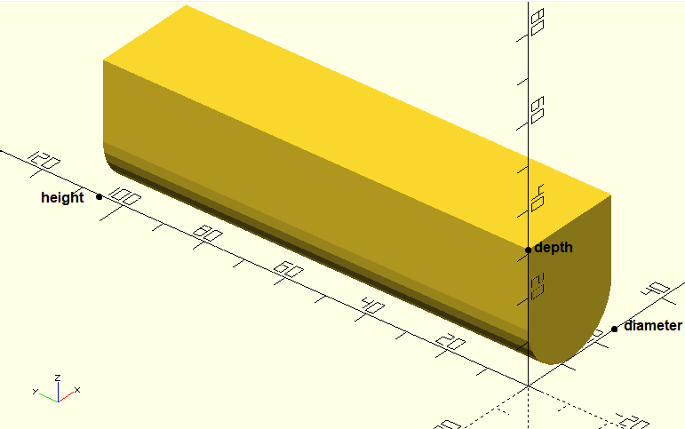

SeparateTokensHolder:
    token = Pipe(23,10,16),
    amount = 3,
    depth = 21,
    separator = 4
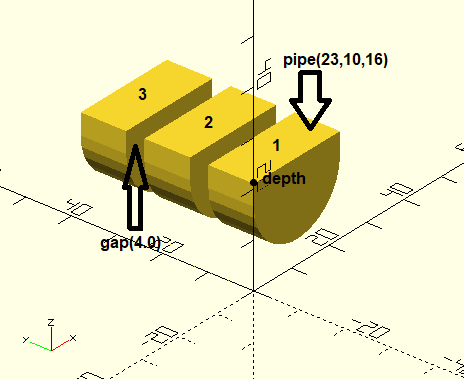

VariousTokensHolder:
    tokens = [Cube(22,22,22),
              Bowl(27, 27, 55),
              Pipe(27, 27, 23),
              Column(10,10)],24)
    depth = 24
    separator = 0.4
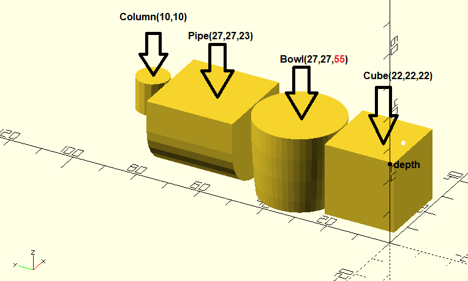
(note that bottom of the Bowl got cut, as the VariousTokensHolder is shallower than the Bowl)

interiors (above) can be put into PlainBox:
(VariousTokensHolder from before is used here)
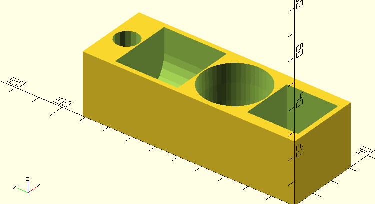

the plainBox also comes with 2 options for the top:
regular (also used above with the VariousTokensHolder):
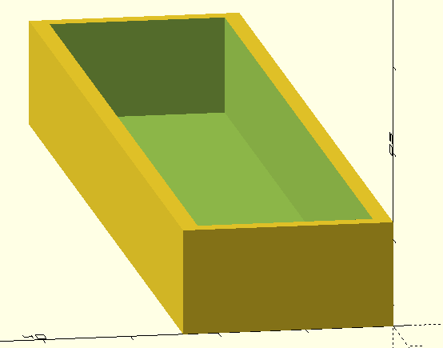

chamfered (useful mostly with rectangular tops, e.g. for easier cards inserting)
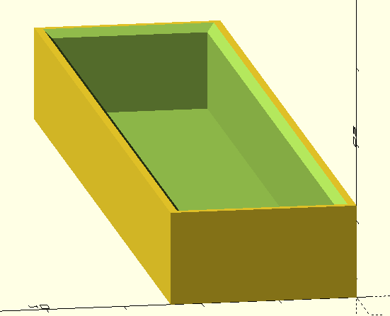

Box can be put into:
WithJoints: 
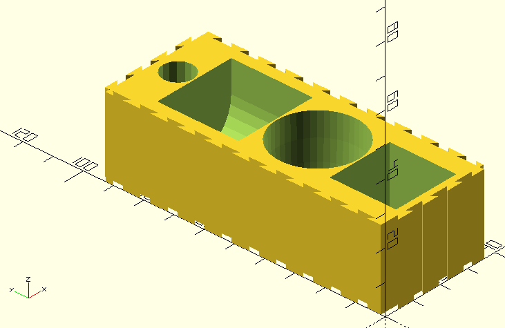
joints are used to connect boxes together.

WithRoundedCorners:
(this time with Cube(100,20,30))
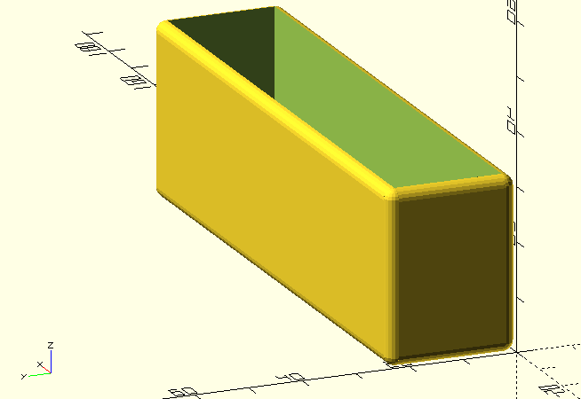

WithVerticalHoles:
(I've exchanged width with height from the previous cube, as the finger holes are in the middle, of the height wall)
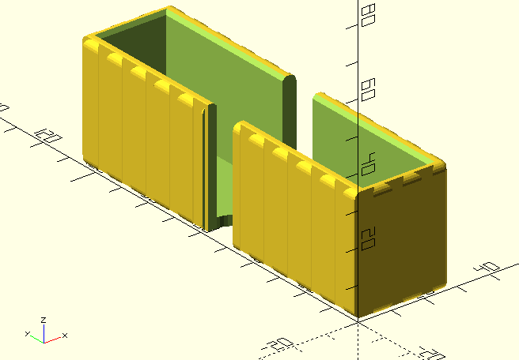
notice, that the floor is thickened in this Box, as the middle was too wiggly without it)

WithHorizontalHole:
 

notice the order! If you put WithRoundedCorners to e.g.WithJoints type, it's gonna end up exactly what you asked for:
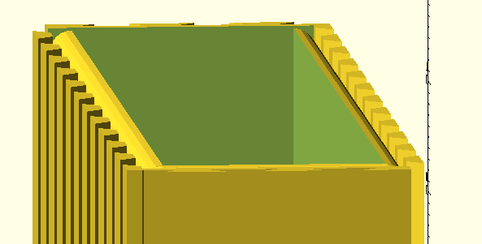

so you probably want to put object WithJoints into the WithRoundedCorners one:
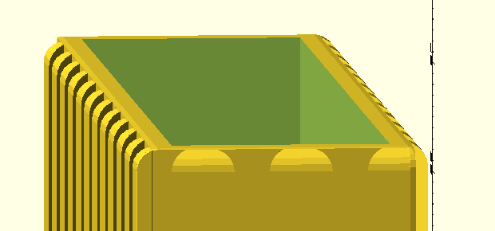
 

