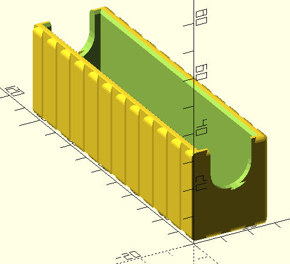

A python generator for creating modular box in openSCAD

Created mostly for organizers for board games, but can be used elsewhere just as successfully.

overview of the classes hierarchy:

<div hidden>
```
@startuml class_hierarchy
class Measured{
    +width
    +height
    +depth
    +get_width()
    +get_height()
    +get_depth()
}

class Interior{
    +get_boundaries()
    +log()
    +scad()
}
Interior-up-|>Measured

Column-up-|>Interior
Bowl-up-|>Interior
SeparateTokensHolder-up--|>Interior
Cube-up-|>Interior
VariousTokensHolder-up--|>Interior
Pipe-up-|>Interior

class Box{
    +get_wall_x()
    +get_wall_y()
    +get_floor()
    +log()
    +scad()
}
Box -up-|>Measured
class BoxBuilder{
    +withRoof(roof)
    +withJoints()
    +withVerticalHoles()
    +withHorizontalHole()
    +build()
}

PlainBox-up-|> Box
WithHorizontalHole-up--|>Box
WithJoints-up-|> Box
WithVerticalHoles-up--|>Box
WithRoundedCorners-up-|>Box

WithJoints-down->Notch
WithRoundedCorners-down->Fillet
Fillet->Box

BoxBuilder-right->Box

@enduml
```
</div>


Implemented interiors for boxes are:
Bowl (parameters for the example on the picture):
    width = 50
    height = 75
    depth = 20

    
Column:
    diameter = 7.5
    depth = 13
    segments = 6


Cube:
    width = 26
    height = 105
    depth = 31


Pipe:
    diameter = 25
    height = 105
    depth = 31


SeparateTokensHolder:
    token = Pipe(23,10,16)
    amount = 3
    depth = 21
    separator = 4


VariousTokensHolder:
    tokens = Cube(22,22,22),
             Bowl(27, 27, 55),
             Pipe(27, 27, 23),
             Column(10,10)],24)
    depth = 24
    separator = 0.4


interiors (above) can be put into PlainBox of type Box:
(VariousTokensHolder from before is used here)


the plainBox also comes with 2 options for the top:
regular (also used above with the VariousTokensHolder):


chamfered (useful mostly with rectangular tops, e.g. for easier cards inserting)


Box can be put into:
WithJoints (of type Box): 

joints are used to connect boxes together.

WithRoundedCorners (of type Box):
(this time with Cube(100,20,30))


WithVerticalHoles (of type Box):
(I've exchanged width with height from the previous cube, as the finger holes are in the middle, of the height wall)

notice, that the floor is thickened in this Box, as the middle was too wiggly)

WithHorizontalHole (of type Box):
 

notice the order! If you put WithRoundedCorners to e.g.WithJoints type, it's gonna end up exactly what you asked for:


so you probably want to put object with joints into the rounded corners one:

 


